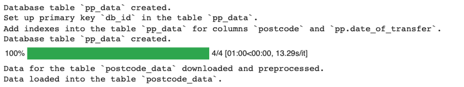
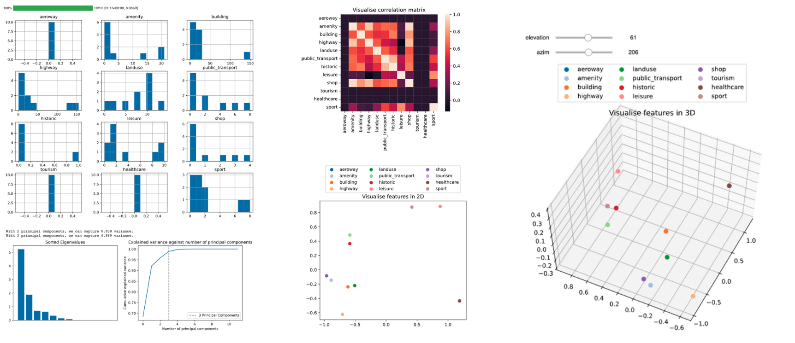

# House price prediction assessment
## Brief overview of fynesse pipeline
The figure below summarised what I have learned and what I have done in this course assessment. I followed the iterative fynesse pipeline which has three stages: access, assess and address. 

For a detailed documentation of the code logic, please refer to the [notebook](https://github.com/KyraZzz/fynesse_house_price/blob/main/notebooks/yz709_notebook.ipynb), note that a preview of the notebook may not display all images properly, so please load the [notebook](https://github.com/KyraZzz/fynesse_house_price/blob/main/notebooks/yz709_notebook.ipynb) in Colab or Jupyter Notebook.


## How to use the library?
### Install libraries
```python
# Install the library
%pip install git+https://github.com/KyraZzz/fynesse_house_price.git
# Install the following libraries manually
%pip install pymysql
%pip install osmnx
%pip install mlai
%pip uninstall --yes matplotlib
%pip install matplotlib==3.1.3
```
### Upload data to the database
```python
# Import libraries
from fynesse.access import config_credentials, create_connection, config_price_data

# Database url
database_details = {"url": <your-database-connection-endpoint-url>, 
                    "port": <your-database-connection-endpoint-port>}

# Store credentials
username, password, url = config_credentials(url=database_details["url"], port=database_details["port"])

# Create database `property_prices`
%load_ext sql
%sql mariadb+pymysql://$username:$password@$url?local_infile=1
%%sql
SET SQL_MODE = "NO_AUTO_VALUE_ON_ZERO";
SET time_zone = "+00:00";
CREATE DATABASE IF NOT EXISTS `property_prices` DEFAULT CHARACTER SET utf8 COLLATE utf8_bin;
USE `property_prices`;

# Set up a database connection
conn = create_connection(username, password, url, database="property_prices")

# Upload data to the database
config_price_data(conn, year_lb = 2021, year_ub = 2022)
```
Here are the result for the above example:

### Assess OSM features
```python
# Import modules
from fynesse.assess import view

# Visualise feature correlations
view(n = 10, seed = 42)
```
Here are the result for the above example:

### Address house price prediction problem
```python
# Import modules
from fynesse.access import config_credentials, create_connection 
from fynesse.address import predict_price, predict_price_fix, predict_price_relaxed_property

# Database url
database_details = {"url": <your-database-connection-endpoint-url>, 
                    "port": <your-database-connection-endpoint-port>}
# Store credentials
username, password, url = config_credentials(url=database_details["url"], port=database_details["port"])
# Set up a database connection
conn = create_connection(username, password, url, database="property_prices")

# Sample data
place_name="Near London"
latitude = 51.3815042 # N
longitude = -0.2554954 # E
date = '2021-11-29'
property_type = "S"

# Predict price
score_df = predict_price(latitude, longitude, date, property_type, conn, train_size_lb=10, train_size_ub=12,
                         train_box_width = 0.03, train_box_height = 0.03, diff_lb = 15, diff_ub = 15)

```
Here are the results for the above example:


