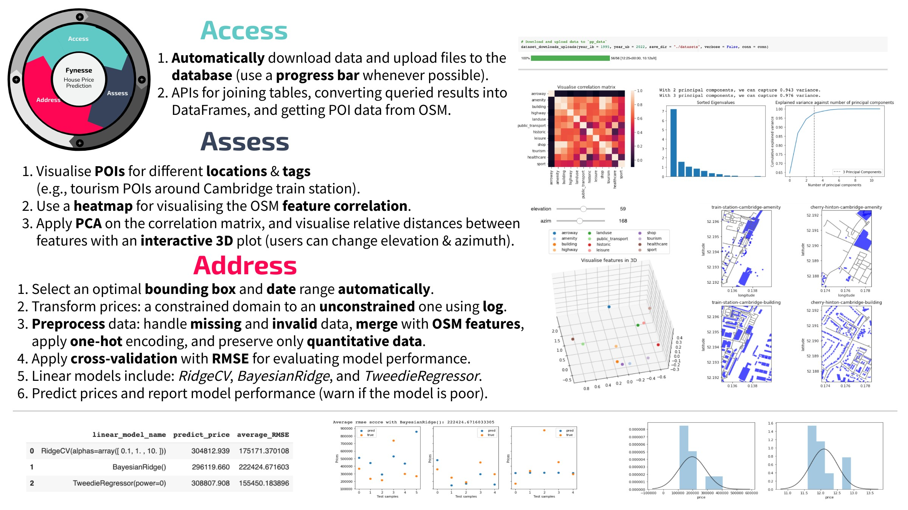
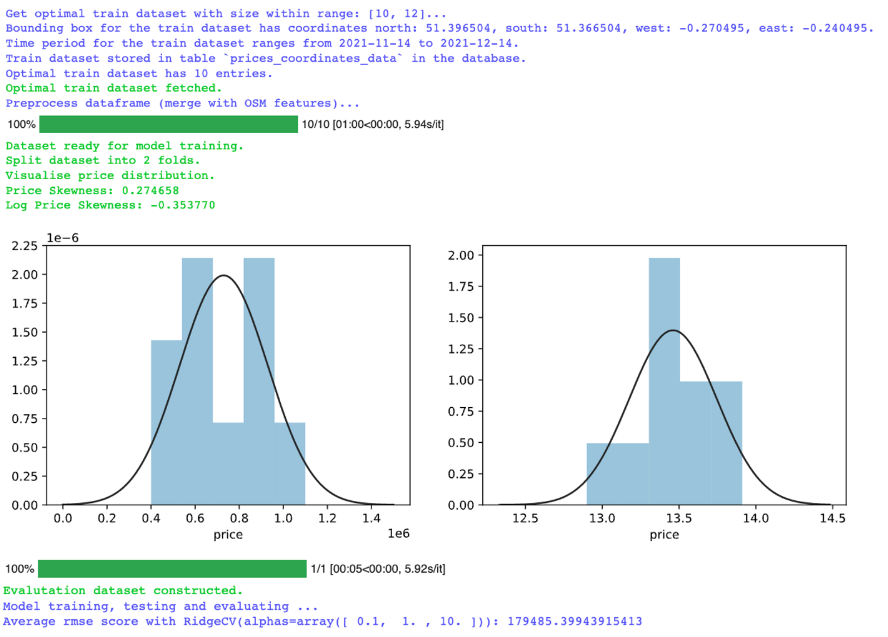
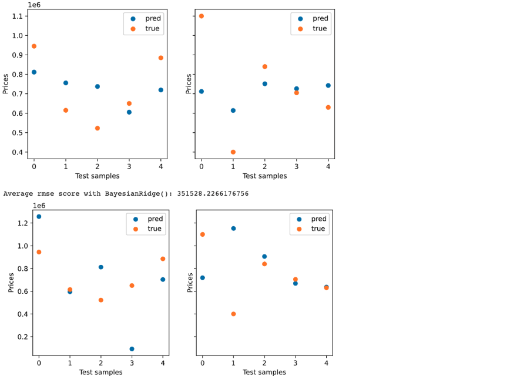
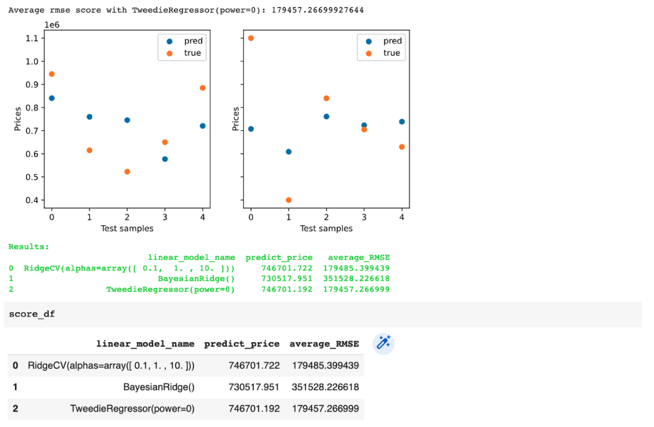

# House price prediction assessment
## Brief overview of fynesse pipeline
The figure below summarised what I have learned and what I have done in this course assessment. I followed the iterative fynesse pipeline that contains three stages: access, assess and address.

## How to use the package?
### Step 1: Set up a database and upload data to the database
### Step 2: Assess OSM features
### Step 3: Address house price prediction problem
```python
# Install the library
%pip install git+https://github.com/KyraZzz/fynesse_house_price.git
# Install the following libraries manually
%pip install pymysql
%pip install osmnx
%pip install mlai
%pip uninstall --yes matplotlib
%pip install matplotlib==3.1.3

# Import modules
from fynesse.access import config_credentials, create_connection 
from fynesse.address import predict_price, predict_price_fix, predict_price_relaxed_property

# Store credentials
username, password, url = config_credentials()
# Set up a database connection
conn = create_connection(username, password, url, database="property_prices")

# Sample data
place_name="Near London"
latitude = 51.3815042 # N
longitude = -0.2554954 # E
date = '2021-11-29'
property_type = "S"

# Predict price
score_df = predict_price(latitude, longitude, date, property_type, conn, train_size_lb=10, train_size_ub=12,
                         train_box_width = 0.03, train_box_height = 0.03, diff_lb = 15, diff_ub = 15)

```
Here are the results for the above example:


